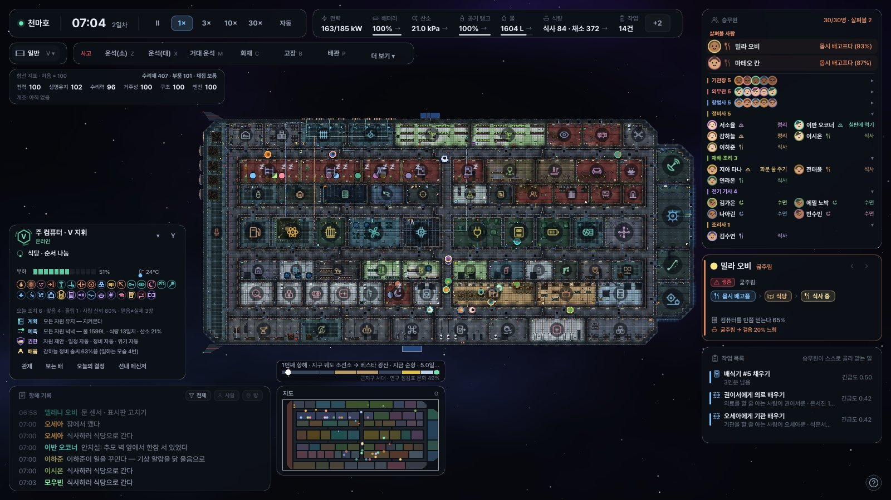
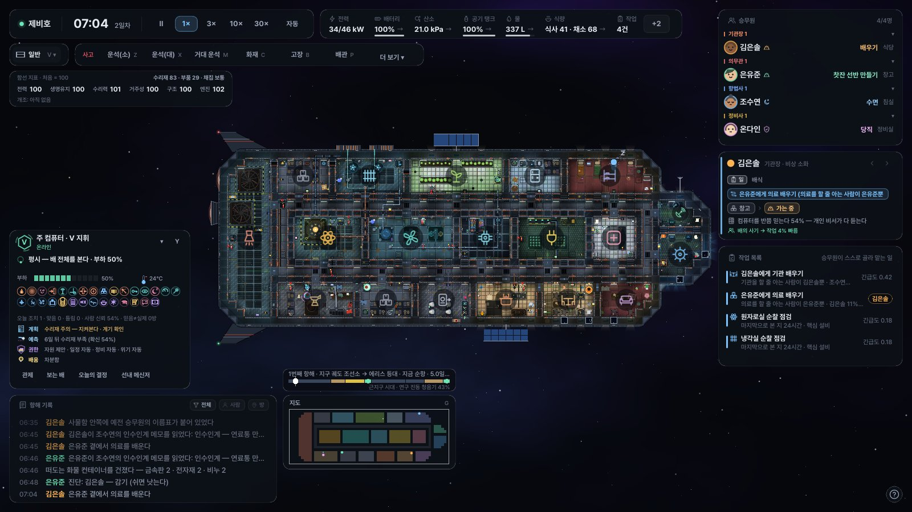
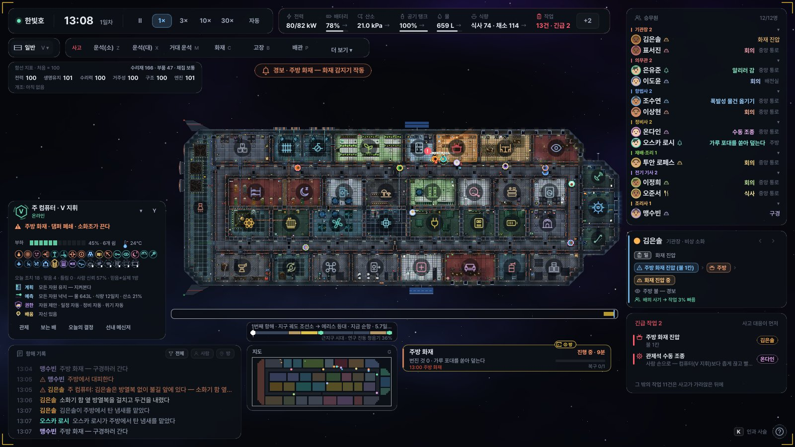
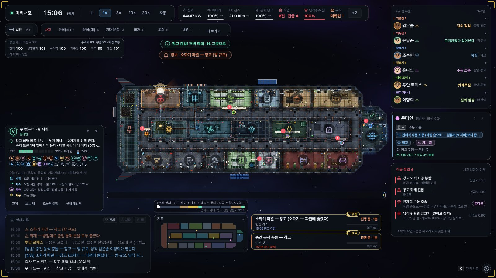
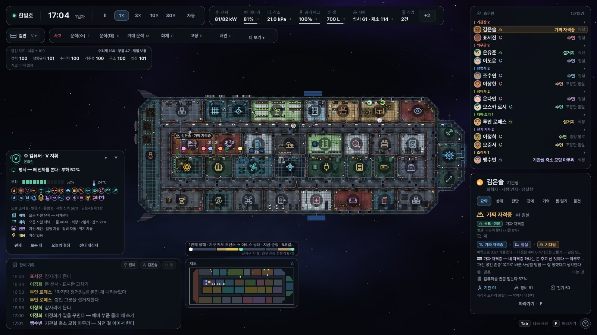
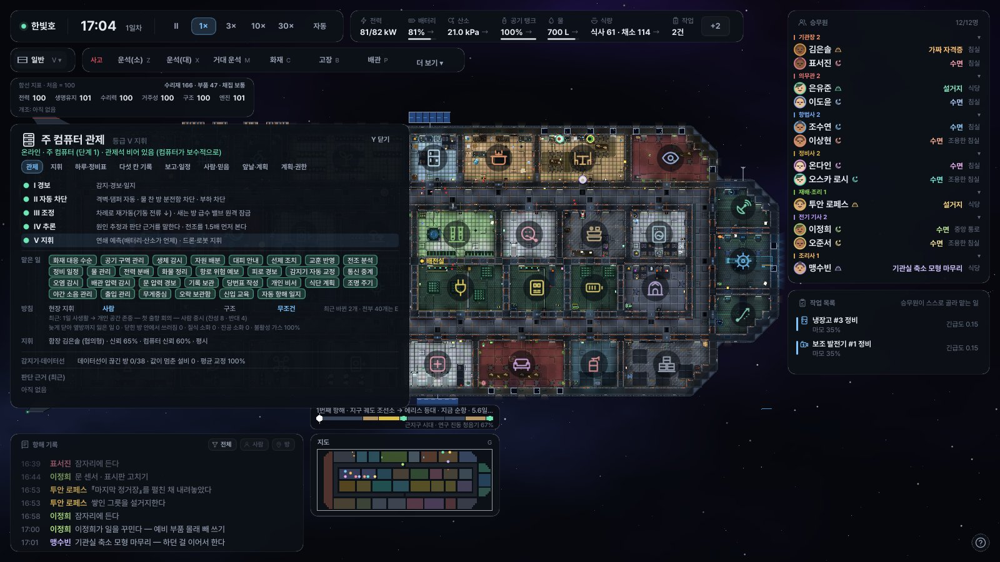
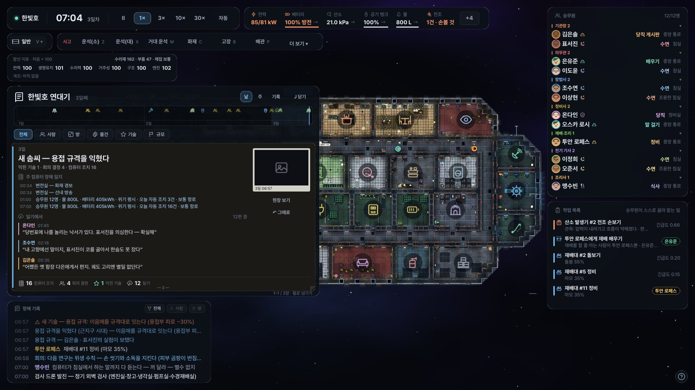
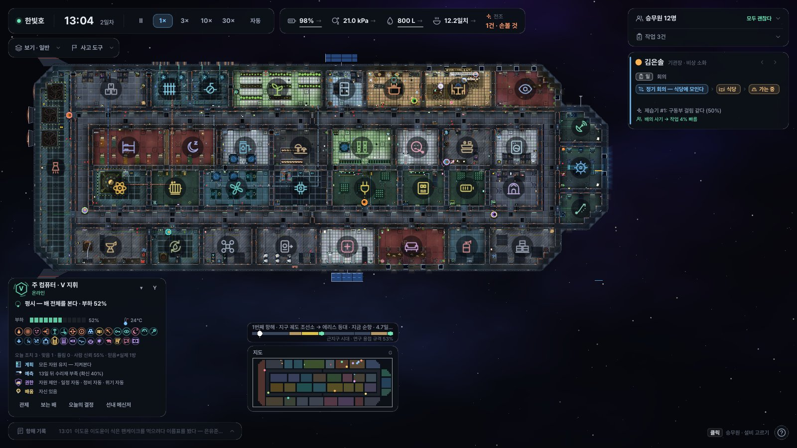
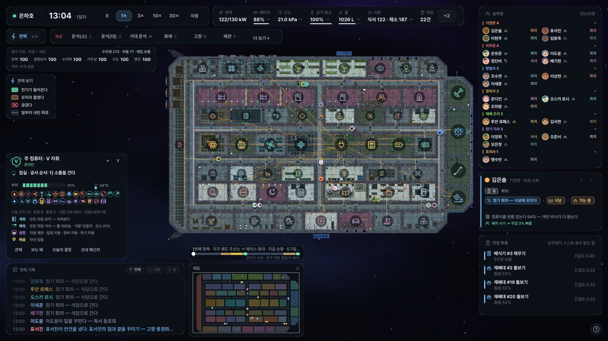

# ShipSim — 우주선 한 척을 지켜보는 시뮬레이션

우주선 한 척에 탄 승무원들과 배의 주컴퓨터를 **처음부터 끝까지 지켜보는** 게임입니다.
사람들은 먹고 자고 일하고 다투고 화해하고, 설비는 닳고 고장 나고, 운석이 외벽을 뚫고, 불이 번지고, 누군가는 그걸 막으러 뛰어갑니다.
그리고 그 모든 일은 사람들의 기억과 배의 모습에 흔적으로 남습니다.

이 게임이 계속 묻는 것은 세 가지입니다.

> **누가 왜 행동했고, 무엇이 바뀌었으며, 누가 그것을 기억하는가.**

Godot 4.7 .NET(C#)으로 만들었습니다. 시뮬레이션(`game/src/Core`)은 Godot을 전혀 모르는 순수 C#이라 화면 없이도 똑같이 돌아가고,
같은 시드면 같은 역사가 나옵니다(결정론). 화면은 그 상태를 그대로 그릴 뿐입니다.

---

## 이 게임은

- **완전 관전입니다.** 플레이어는 승무원에게 일을 시키지 않고, 주컴퓨터의 제안을 받거나 거절하는 단추도 없습니다.
  무엇을 할지는 **함장 · 회의 · 주컴퓨터**가 정하고, 각자는 자기가 보고 듣고 전해 들은 만큼만 압니다.
- 플레이어가 하는 일은 **보는 것**입니다 — 시간을 빠르게/느리게 돌리고, 사람이나 물건을 따라가고, 지나간 사고를 되짚고, 기록을 읽습니다.
  배가 어떻게 버티는지 보고 싶으면 운석 · 화재 · 고장 같은 **사고를 일으킬 수는 있습니다**(그 뒤의 대응은 전부 배 안 사람들 몫입니다).
- 끝없는 샌드박스가 기본이고, 항해를 마치면 결산 카드와 연대기가 남습니다.

---

## 화면

실제 게임을 돌려 찍은 화면입니다 (1600×900 · `--shot`).

| | |
|---|---|
|  |  |
| **큰 배** — 30명이 사는 천마호의 아침. 오른쪽은 직책별 승무원 목록과 지금 눈여겨볼 한 사람 | **작은 배** — 4명이 사는 제비호. 왼쪽 아래가 늘 떠 있는 주컴퓨터 카드(지금 하는 일 · 계획 · 예측 · 권한) |
|  |  |
| **주방 화재** — 화재 감지기 경보, 컴퓨터가 댐퍼를 닫고 소화조를 부르고, 사람들은 방열복을 걸치고 들어간다 | **운석 충돌** — 창고 외벽이 뚫리고 소화기가 파편에 터진다. 컴퓨터가 수리 드론과 사람 중 누가 막을지 견줘 본다 |
|  |  |
| **승무원 카드** — 무엇을, 왜 하는지(목표 · 이유 사슬 · 믿음 · 기술) | **주컴퓨터 관제**(Y) — 등급 사다리 · 맡은 일 · 방침 · 지휘 · 감지기 · 판단 근거 |
|  |  |
| **연대기**(J) — 날마다의 장, 컴퓨터 항해 일지, 승무원 일기 | **조용한 화면** — 평상인 것은 접고 배를 크게 |


**전력 보기**(V) — 20명이 사는 은하호의 배선과 차단기

---

## 무엇을 볼 수 있나

### 승무원

한 사람 한 사람이 자기 머리로 움직입니다. 승무원을 누르면 "왜 지금 이걸 하는지"가 보입니다.

- **마음** — 믿음(사실과 다를 수 있는 생각) · 감정 · 여러 단계로 짜는 계획 · 가치관 · 버릇. 같은 사고를 겪어도 사람마다 다르게 기억하고 다르게 반응합니다.
- **몸** — 위에서 본 인형처럼 그려지고, 손 · 시선 · 자세 같은 몸짓이 있습니다. 다치면 재활을 하고, 옷 · 보호구 · 안경 · 손에 익은 공구를 챙깁니다.
- **관계와 이야기** — 사람마다 3~5단계의 개인 이야기(고향 가족 · 빚 · 과거), 중요한 순간의 대화, 캠프의 밤 같은 잡담, 로맨스(결혼 · 이별까지).
  고향에서 편지가 오고, 늦게 답장이 갑니다.
- **사회** — 누구나 안건을 내고 서명을 모읍니다. 회의 · 파벌 · 재판 · 선거가 열리고, 진 쪽에는 불만이 남습니다.
- **스스로 꾸미는 일 112종** — 몰래 정원 가꾸기, 밀주, 동호회, 깜짝 선물, 내기 · 물물교환 같은 것들을 승무원이 알아서 벌입니다.
- **실수 숨기기** — 자기 실수를 숨겼다가 블랙박스 조사로 들키면 관계가 바뀝니다.
- **위기와 그 뒤** — 공황 · 훈련 · 경험이 위기 행동을 가르고, 사고 뒤 며칠은 젖은 침구를 널고 꿈을 꾸고 그 장소를 피하기도 합니다.
- **일상** — 늘 앉는 자리, 하다 만 일, 체스, 요리와 냄새, 방 꾸미기. 어느 방을 무엇으로 쓸지도 승무원이 정합니다.

### 주컴퓨터

배의 두뇌이자 한 명의 구성원입니다. 감지기로 본 것만 알기 때문에, **컴퓨터가 믿는 배와 실제 배가 어긋날 수 있습니다.**

- **예측 · 여러 단계 계획 · 실행 · 확인 · 고침** — 앞으로 어떻게 될지 미리 돌려 보고 계획을 세우고, 해 본 뒤 결과를 확인해 고칩니다.
- **자율 복구와 전력 나눠 쓰기**, 그리고 사고가 끝난 뒤의 **검토**(회의 안건으로 올라갑니다).
- **성격**이 있어 말투가 다르고, 아침에는 오늘 일정 · 정비 계획 · 우주 날씨를 **방송**하고, 저녁에는 **항해 일지**를 씁니다.
- **돌봄** — 잠 · 식사 · 일기 분위기에서 우울 징후를 알아채고 친한 동료에게 넌지시 알립니다(어디까지 살펴도 되는지는 회의가 정합니다).
- **로봇 · 드론 지휘** — 로봇과 드론도 각자 판단하고, 컴퓨터가 함대처럼 부립니다.
- 컴퓨터의 제안은 함장이나 회의가 자연스러운 때 정합니다. 관제 화면에서 무엇을 · 왜 · 누가 정하는지를 볼 수 있습니다.

### "이게 돼?"

문제마다 정해진 답 하나가 아니라 **여러 갈래 해법**이 있습니다. 불이 나면 소화기로 끌 수도, 소화 계통을 돌릴 수도,
문을 닫아 산소를 끊거나 방을 진공으로 만들 수도 있습니다. 사람 · 로봇 · 컴퓨터 · 환경 · 물건 조합 · 규칙 어기기 · 희생 중 무엇을 고를지는
배 안 사람들이 상황을 보고 정합니다. 보는 사람이 "어? 저걸로 저게 돼?" 하게 만드는 것이 목표입니다.

### 배

- **크기별 기본 5척** — 제비호(4인) · 미리내호(6인, 기본) · 한빛호(12인) · 은하호(20인) · 천마호(30인). 작을수록 꼭 필요한 방만, 클수록 방 종류가 많고 호화롭습니다.
- **손으로 그린 대표 배 6척** — 새터호(40인 고리형 이민선) · 부싯돌호(채굴선) · 보듬호(병원선) · 나르미호(보급선) · 땜질호(누더기 고물선) · 파발호(2인 우편선).
- **생성 배 60가지** — 용도 10 × 뼈대 6(직선 · 고리 · 척추 · 바퀴 · 화물선 · 누더기), 2~60인. 같은 키는 같은 배입니다.
- **증축 · 개조** — 겪은 일에 따라 승무원이 방을 바꾸고, 칸막이를 세우고, 배를 늘립니다.
- **방 72종 · 설비 100 · 기술 141** — 설비마다 고유한 그림과 단계가 있고, 기술이 바뀌면 모양도 바뀝니다. 기술은 그물처럼 이어져 있습니다.
- **사고 100 · 다섯 규모** — 사람 · 방 · 계통 · 배 · 우주급. 전조와 흔적이 있고, 한 사고가 다른 사고를 부릅니다.
  초신성 · 감마선 폭발 · 마그네타 폭풍 같은 **우주 규모 대재난**도 있습니다.

### 물리와 생활 환경

- **재질 · 원소** — 젖음 · 열 · 무게 · 마찰 · 오염 · 전도가 물건마다가 아니라 재질과 위치로 정해집니다. 그래서 같은 규칙이 여러 물건에 통합니다.
- **무중력** — 회전 고리가 서거나 인공 중력이 고장 나면 물건과 물방울이 떠다니고, 사람은 손잡이를 잡고 움직입니다.
- **기동 충격** — 기동을 예고하면 선반을 잠그고 카트를 묶고 자리에 앉습니다. 못 챙긴 컵은 쏟아집니다.
- **선내 생태계** — 고양이, 화분, 곡식 바구미. 배수 · 쓰레기 · 재활용도 가볍게 돌아갑니다.
- **도킹 · 난파선** — 다른 배와 도킹하고, 버려진 배를 탐사해 해체하고, 예인 · 구조 · 급유를 합니다.
- **승객** — 일하지 않는 사람들. 불만을 말하고, 공황에 빠지고, 자원봉사를 나서기도 합니다.
- **재료와 수리** — 선체 밖에서 재료를 모아 부품을 만들고, 정품이 없으면 임시품으로, 그것도 없으면 다른 설비를 뜯어 고칩니다. 흉터와 땜질은 배에 남습니다.

### 화면

- **연대기**(J) — 운석 · 화재 · 쓰러짐 · 결정 · 개조 · 교훈이 날마다 쌓이고, 날마다 사진 한 장이 걸립니다.
- **사고 카드 · 사고 사슬**(K) — 무엇이 무엇을 불렀는지 한 줄로 이어 봅니다. ⇧K는 규모별 사고 도감.
- **관제 화면**(Y) — 주컴퓨터의 상태 · 판단 근거 · **지휘 탭**(컴퓨터가 믿는 배 지도 · 명령선 · 견줘 본 판단 · 전력 흐름) · 하루 일정.
- **보기 모드**(V) — 일반 · 전력 · 공기 · 온도 · 상태 · 흔적 · 구조 · 배관 · 감지기 · 환경 · 컴퓨터(컴퓨터가 보는 배).
- **확대 3단계** — 멀리서는 실루엣, 가까이 가면 손잡이 · 계기 · 들고 있는 물건까지 보입니다.
- **접근성 · 음악** — 색약 팔레트(사람은 표식 모양, 방은 바닥 무늬로도 구분) · 글자 크기 · 배경 음악 · 배 안에서 트는 음악(설정 O).
- **도감** — 설비 · 방 설명서(I), 사진 · 표본 · 유물 · 사람들을 모으는 수집 도감(⇧I). 배 곳곳에 숨은 것과 드문 것이 있습니다.
- **관찰 도구** — 물건 따라가기(Q: 선물 · 사진 · 공구 · 유품이 거친 손), 사진 모드(F2), **항해 결산 카드**(⇧J), 하이라이트(L) · 요약 진행(U).

> 지금 화면은 위 [화면](#화면)과 `docs/screens/`에 있습니다. `docs/screenshot*.jpg` · `docs/screenshots/`는 v10~v14 때 찍은 옛 화면입니다.
> 직접 찍으려면 아래 `--shot` 인자를 쓰면 됩니다.

---

## 실행

1. **Godot 4.7.2 .NET 버전**을 설치합니다 (godotengine.org → Download → ".NET" 표시가 있는 쪽).
2. **.NET SDK 8 이상**을 설치합니다.
3. Godot 프로젝트 관리자에서 `game/project.godot`를 가져옵니다.
4. 오른쪽 위 망치 아이콘(Build)을 한 번 누른 뒤 실행(F5)합니다.

명령줄로 빌드만 확인하려면:

```
cd game && dotnet build
```

> Godot 버전이 다르면 `game/ShipSim.csproj` 첫 줄의 `Godot.NET.Sdk/4.7.2`를 설치한 버전으로 바꿔 주세요.

**내보내기**: 에디터 메뉴 편집기 → 내보내기 템플릿 관리에서 4.7.2 **.NET** 템플릿을 받은 뒤, 프로젝트 → 내보내기 → `Windows Desktop` 또는 `Linux` → 프로젝트 내보내기.
명령줄로는

```
godot --headless --path game --export-release "Windows Desktop" ../build/windows/ShipSim.exe
```

설정은 `game/export_presets.cfg`에 있습니다 (pck를 실행 파일에 넣음, x86_64).

---

## 조작

| 입력 | 동작 |
|---|---|
| 마우스 휠 | 커서 기준 확대 / 축소 |
| 우클릭 · 휠클릭 드래그, WASD · 방향키 | 화면 이동 |
| 클릭 | 승무원 · 로봇 · 설비 · 방 선택 (오른쪽에 자세히) |
| Tab / ⇧Tab | 다음 / 이전 승무원 |
| F | 고른 승무원 따라가기 |
| Q / ⇧Q | 손을 많이 거친 물건 따라가기 |
| H 또는 Home | 화면을 배에 맞추기 |
| Space | 일시정지 |
| 1 2 3 4 | 1× · 3× · 10× · 30× |
| V / ⇧V | 보기 모드 바꾸기 |
| J / ⇧J | 연대기 / 항해 결산 |
| K / ⇧K | 사고 사슬 / 규모별 사고 도감 |
| Y | 관제 화면 (주컴퓨터) |
| E / ⇧E | 방침 / 회의록 (안건 · 표결 · 파벌) |
| T / ⇧T | 기술 / 기술 지도 |
| I / ⇧I | 설명서 / 수집 도감 |
| G | 미니맵 |
| N | 가장 최근 경보가 난 곳으로 |
| [ / ] | 지나온 사고를 하나씩 넘겨 보기 |
| R | 고른 사고(없으면 가장 최근 치명 경보)의 몇 분 전으로 되감기 — 같은 역사가 다시 흐릅니다 |
| L | 하이라이트: 평온하면 빠르게, 일이 나면 1배속으로 그 현장에 |
| U | 요약 진행: 평온한 날은 화면 없이 감고, 큰 일이 나면 멈춰 한 장으로 요약 |
| F2 | 사진 모드 (Enter · PrintScreen 찍기, Esc 나가기 — `user://photos`에 저장) |
| F5 / F9 | 저장 / 불러오기 |
| O | 설정 (소리 · 음악 · 색약 · 글자 크기 · 새 항해: 배와 승무원 수) |
| ? 또는 F1 | 도움말 |
| Esc | 사고 도구 취소 / 메뉴 닫기 / 선택 해제 |
| Z / X / M | 사고 일으키기: 작은 · 큰 · 거대 운석 → 맞힐 곳 클릭 |
| C / B / P | 사고 일으키기: 화재 · 설비 고장 · 배관 파손 → 대상 클릭 |
| ⇧클릭 | 사고 도구를 유지한 채 연속으로 |

화면 위쪽 **더 보기 ▾**에서 다른 사고들과 무작위 사고 주기를 고를 수 있습니다.

---

## 명령줄 인자

Godot 실행 인자의 `--` 뒤에 붙입니다 (에디터: 프로젝트 설정 → Editor → Run → Main Run Args). 대부분 적힌 순서대로 적용됩니다.

**새 항해**

| 인자 | 뜻 |
|---|---|
| `--seed=11` | 시드 (같은 시드 = 같은 역사) |
| `--ship=Hanbit` | 배. `Kestrel` · `Mirinae` · `Hanbit` · `Eunha` · `Cheonma` · `Saeteo` · `Busitdol` · `Bodeum` · `Nareumi` · `Ttaemjil` · `Pabal`, 생성 배는 `gen:용도:뼈대:인원:시드` (예 `gen:mining:ring:10:3`). `--crew` 없이 주면 그 배의 설계 인원 |
| `--crew=10` | 승무원 수 |
| `--load=경로` | 저장한 항해를 불러와 시작 · `--save=경로` 지금까지를 저장 |
| `--death` / `--nodeath` | 승무원 사망 켜기 / 끄기 |
| `--scarcity` | 부품이 바닥난 채로 시작 |
| `--history=60:10` | 60일 동안 10일마다 무작위 사고를 겪은 배로 시작 |
| `--campaign` · `--campaign=2` | 이번 항해를 캠페인 / 세대선으로 |

**시간 · 카메라 · 화면**

| 인자 | 뜻 |
|---|---|
| `--warp=6` | 시작 전에 6시간을 미리 돌림 (`--warpmin=` 은 분 단위) |
| `--speed=0..3` · `--pause` | 배속 · 일시정지로 시작 |
| `--zoom=2` · `--focus=Storage` | 확대 · 그 방으로 화면 이동 |
| `--select=0` · `--tab=1` · `--room=Galley` · `--machine=CoolantPump` · `--robot=0` | 승무원 · 상세 탭 · 방 · 설비 · 로봇 선택 |
| `--view=Power` · `--view2=Air` | 보기 모드 (`Normal` `Power` `Air` `Temperature` `Condition` `Trace` `Structure` `Pipes` `Sensors` `Ambience` `Belief`) |
| `--hud=all` | 숨긴 패널까지 모두 · `safe` 색약 팔레트 · `codex` 수집 도감 · `help` 도움말 |
| `--chronicle` · `--control` · `--codex` · `--tech` · `--options` · `--tutorial` | 그 화면을 연 채로 시작 |
| `--photo` · `--follow` · `--voyage` · `--snapat=N` | 사진 모드 · 물건 따라가기 · 항해 결산 · N 프레임에 사진 |
| `--summary=일수` | 시작하자마자 요약 진행 |
| `--shot=out.png` (`--frames=N`) | 몇 프레임 뒤 화면을 PNG로 저장하고 종료 |
| `--perf=N` · `--census` · `--nobake` | 프레임 시간 재기 · 그리는 것 세기 · 구워 둔 그림 끄기(비교용) |

**사고 걸기 (화면 시험용)**

| 인자 | 뜻 |
|---|---|
| `--meteor=Storage:1` | 그 방 외벽에 운석 (크기 0.35 작음 ~ 1 큼 ~ 1.5 거대) |
| `--fire=Galley` · `--break=CoolantPump` | 그 방에 불 · 그 종류 첫 설비 고장 (끝에 `*`면 전부) |
| `--hazard=GasLeak:LifeSupport` · `--hazard=SolarStorm` | 사고 목록의 사고를 건다 (대상 방 · 번호, 배 전체는 이름만) |
| `--scenario=nosealant` | 헤드리스와 같은 사고 시험 장면 |
| `--random=3` | 무작위 사고 평균 3일마다 (0이면 끔) |
| `--tool=BigMeteor` · `--hazardmenu` | 사고 도구를 고른 채로 · 사고 메뉴를 연 채로 시작 |
| `--episode=1` · `--rewind` | 지나온 사고를 고르고 그 몇 분 전으로 되감기 |

예:

```
# 한빛호, 하루 돌린 뒤 창고에 큰 운석 — 20분 뒤 창고를 골라서 보기
--ship=Hanbit --warp=24 --meteor=Storage:1 --warp=0.3 --room=Storage --pause

# 생명유지실에 유독 가스와 태양 폭풍, 무작위 사고를 켜고 엿새 뒤
--warp=26 --hazard=GasLeak:LifeSupport --hazard=SolarStorm --random=3 --warp=6 --focus=LifeSupport --zoom=2.2 --pause

# 부품 없이 60일을 겪은 배의 연대기를 찍고 끝내기
--seed=11 --scarcity --history=58:10 --chronicle --shot=chronicle.png
```

---

## 시험 · 점검 도구

### 헤드리스 시험

화면 없이 시뮬레이션만 빠르게 돌립니다. 규칙을 바꿨으면 이걸로 장면이 실제로 일어나는지, 결정론이 지켜지는지 봅니다.

```
cd tools/Headless && dotnet build -c Release
dotnet bin/Release/net8.0/Headless.dll 14 7              # 14일 · 시드 7: 하루마다 살림살이 · 고장 · 승무원 상태 · 결정론
dotnet bin/Release/net8.0/Headless.dll 1 7 --braintest   # 시험 하나 (앞 두 숫자는 일수 · 시드)
```

`--ship=` · `--crew=` · `--death` · `--scarcity` · `--quiet` · `--chronicle`(끝에 연대기 출력)도 함께 쓸 수 있습니다.

주요 시험:

| 시험 | 보는 것 |
|---|---|
| `--selftest` | 기본 점검 묶음 |
| `--integtest` | 배 · 화면 · 주컴퓨터 토대를 함께 엮은 통합 장면 |
| `--braintest` · `--mindtest` · `--valuetest` | 승무원 판단 · 믿음과 감정 · 가치관과 딜레마 |
| `--talestest` · `--relationtest` | 개인 이야기 · 대화 카드 · 로맨스 · 관계 |
| `--counciltest` · `--meetingtest` | 회의 · 파벌 · 재판 · 선거 |
| `--schemetest` · `--blackboxtest` | 스스로 꾸미는 일 · 실수 숨기기와 블랙박스 |
| `--crisistest` · `--aftertest` | 위기 행동 · 사고 뒤 며칠 |
| `--computerplantest` · `--computercrewtest` · `--shipcomputertest` | 주컴퓨터 예측 · 계획 · 확인 / 방송 · 일지 · 돌봄 / 자율 복구 |
| `--fleettest` · `--robottest` | 로봇 · 드론 지휘 |
| `--waystest` | "이게 돼?" — 문제마다 여러 갈래 해법 |
| `--maneuvertest` · `--zerogtest` | 기동 충격 · 무중력 · 생태계 · 배수 |
| `--docktest` · `--smalltest` | 도킹 · 난파선 · 승객 / 옷 · 편지 · 배 종류 · 내기 |
| `--liststest` · `--scaletest` · `--cosmictest` | 사고 · 설비 · 기술 목록 / 사고 규모 / 우주 대재난 |
| `--shipdesigntest` · `--annextest` · `--roomtest` | 배 설계와 크기 등급 / 증축 / 방은 승무원이 정한다 |
| `--hudtest` · `--uitest` | 화면 배치 규칙 |
| `--perftest` | 60인 배 · 복합 재난 성능 |
| `--savetest` | 저장 · 불러오기가 같은 역사를 내는지 |
| `--scenario=all` | 사고 시험 장면 전부를 한 줄씩 (결과를 완전 복구 / 부분 복구 / 장기 장애 / 실패로 분류) |

전체 목록은 `tools/Headless/Program.cs` 의 `Main` 에 있습니다. 긴 회귀를 한 번에 돌리려면 `tools/regress.sh [출력 폴더] [동시에 돌릴 수]`.

### 점검 항해

사람이 플레이하며 찾던 이상한 장면(굶주림 · 막힌 동선 · 멈춘 일 · 이상한 결정 …)을 헤드리스로 찾아 보고서로 냅니다.
항해 하나를 프로세스 하나로 돌려 서로 섞이지 않게 합니다.

```
dotnet bin/Release/net8.0/Headless.dll --audit [일수=10] [시드들=7,11,13] [배들=기본 5척+생성 3척]
dotnet bin/Release/net8.0/Headless.dll --audit 2 7 Hanbit          # 짧게 확인
```

`--jobs=4`(동시에) · `--out=폴더` · `--persona=` · `--level=1..5`(이야기꾼 성격 · 난이도)를 붙일 수 있습니다.
보고서는 **`docs/audit/AUDIT_<날짜>_s<시드들>_d<일수>.md`**(+ `.json`)로 남고, 이전 보고서와 비교됩니다.
규칙만 고친 뒤에는 `--audit --audit-report=docs/audit/AUDIT_….json` 으로 시뮬레이션 없이 보고서만 다시 씁니다.

---

## 폴더

```
game/                    Godot 프로젝트
  src/Core/              시뮬레이션 (순수 C# — 승무원 · 주컴퓨터 · 배 · 물리 · 사고 · 기술 …)
  src/View/              화면 (배 그리기 · 인형 · 설비 그림 · HUD · 카메라 · 소리)
  assets/                폰트 · 아이콘 · 텍스처
tools/Headless/          헤드리스 시험 · 점검 항해
tools/shipgen/           기본 배 다섯 척 설계도 생성기 (gen_ships.py → Core/ShipTemplates.cs)
tools/texgen/            재질 텍스처 생성기 (C# → game/assets/textures/look_*.png, -- --check 로 같은지 확인)
tools/textures/          예전 텍스처 생성기 (make_textures.py)
tools/regress.sh         긴 회귀 한 번에
docs/                    계획 · 설계 문서 · 점검 보고서
```

---

## 문서

- [`docs/PLAN_v16.md`](docs/PLAN_v16.md) — **지금 계획과 진행** (v16~v18: 원칙 · 단계별 범위와 완료 기준 · 남은 묶음)
- [`docs/DIRECTION.md`](docs/DIRECTION.md) — 분야별로 토론해 정한 설계 방향 (플레이어 역할 · 설비 · 사고 · 사람 …)
- [`docs/DESIGN.md`](docs/DESIGN.md) — 처음 기획서 (게임의 뼈대)
- [`docs/ROADMAP.md`](docs/ROADMAP.md) · [`docs/PROGRESS.md`](docs/PROGRESS.md) — v3~v15 때의 순서와 진행 메모 (지난 기록)
- [`docs/audit/`](docs/audit/) — 점검 항해 보고서 · [`docs/regress/`](docs/regress/) — 예전 회귀 결과

---

## 라이선스 메모

- 폰트: `game/assets/fonts`의 Pretendard는 SIL Open Font License (`Pretendard-LICENSE.txt`).
- 텍스처: `tools/texgen`(지금) · `tools/textures`(예전)로 생성한 것이라 자유롭게 고쳐 쓰면 됩니다.
