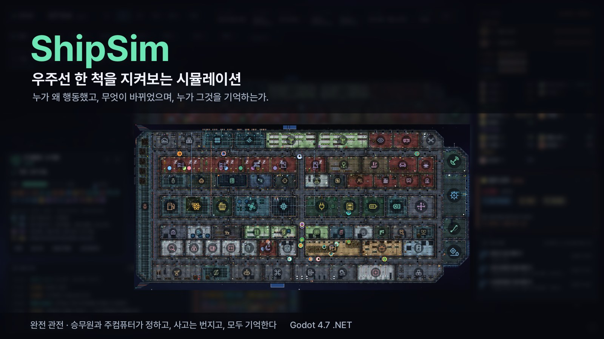
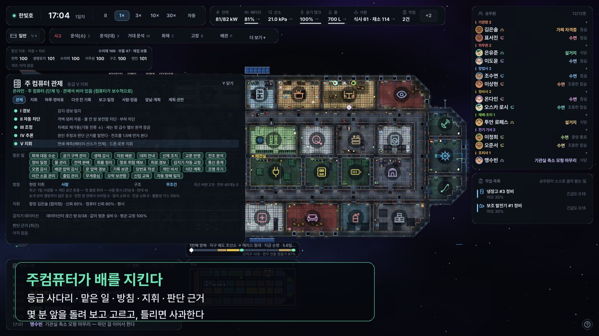
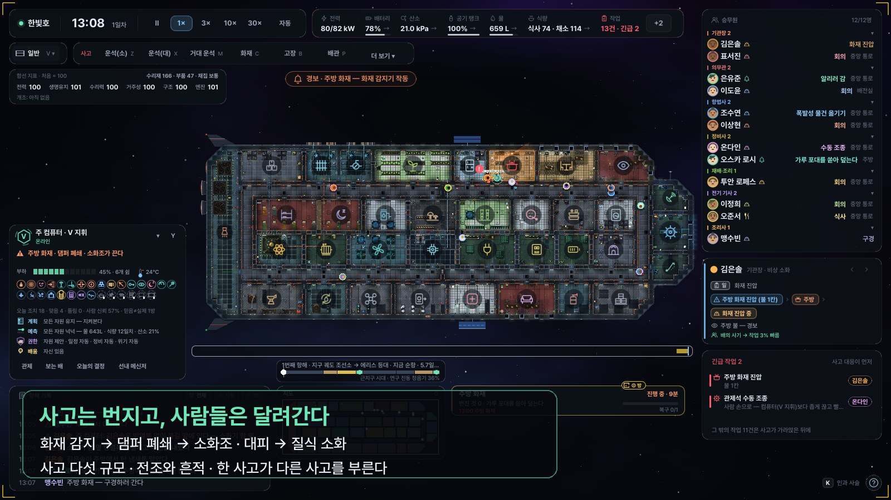
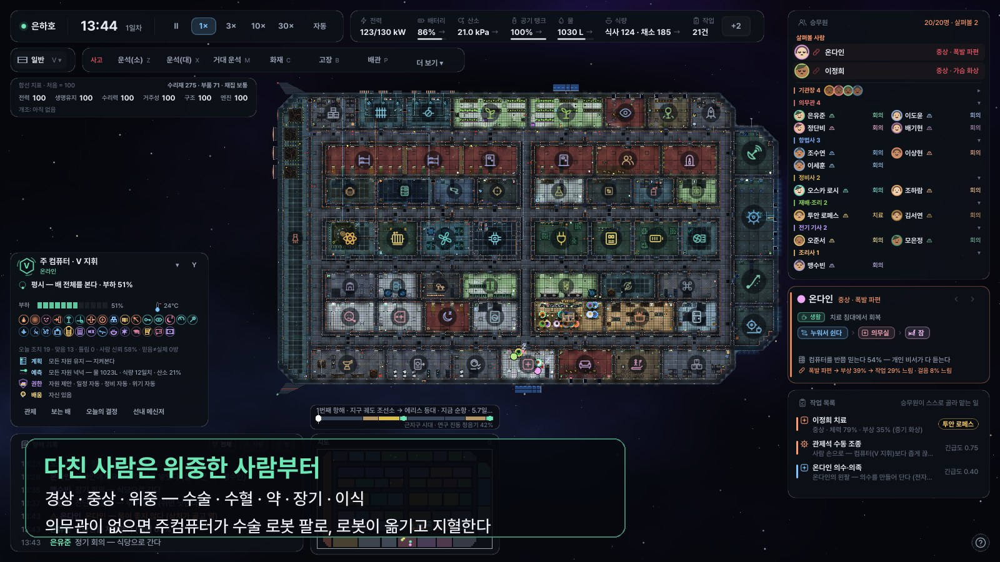
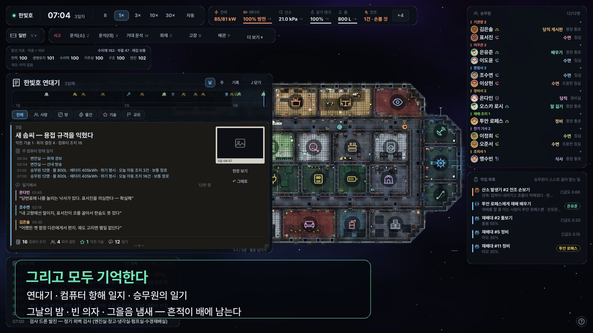

# ShipSim — 소개 · 포스터 · 트레일러



**트레일러 (45초)** — [ShipSim_trailer.mp4](ShipSim_trailer.mp4)
실제 게임을 돌려 녹화한 장면에 자막만 얹었습니다 (1280×720 · 30fps).

---

## 한 줄

> **우주선 한 척. 사람들, 그리고 주컴퓨터.**
> 누가 왜 행동했고, 무엇이 바뀌었으며, 누가 그것을 기억하는가.

## 짧은 소개

별 사이를 건너는 우주선 한 척에 사람들이 삽니다.
그들은 먹고, 자고, 일하고, 다투고, 화해합니다. 설비는 닳고, 고장 나고, 언젠가는 불이 납니다.

당신은 함장이 아닙니다. 아무에게도 명령하지 않습니다.
무엇을 할지는 **함장 · 회의 · 주컴퓨터**가 정하고, 사람마다 자기가 보고 들은 만큼만 압니다.
당신이 하는 일은 **지켜보는 것**입니다. 시간을 빠르게 돌리고, 한 사람을 따라가고, 지나간 사고를 되짚고, 그날의 기록을 읽습니다.

그리고 사고는 언제나 옵니다.
운석이 창고 외벽을 뚫으면 주컴퓨터는 몇 분 앞을 돌려 보고 수리 드론과 사람 중 누가 막을지 고릅니다.
주방에 불이 나면 댐퍼가 닫히고, 누군가 방열복을 걸치고 뛰어 들어가고, 누군가는 문 앞에서 얼어붙습니다.
다친 사람은 위중한 사람부터 수술대에 오릅니다. 의무관이 없으면 주컴퓨터가 수술 로봇 팔을 움직입니다.

며칠 뒤에도 복도에는 그을음 냄새가 남고, 식탁에는 빈 의자가 하나 생깁니다.
누군가는 그날 밤 꿈을 꾸고, 누군가는 일기에 적고, 주컴퓨터는 항해 일지에 남깁니다.

## 이런 게임입니다

- **완전 관전** — 일을 시키는 단추가 없습니다. 원하면 운석 · 화재 · 고장 같은 사고를 일으킬 수는 있지만, 그 뒤는 전부 배 안 사람들 몫입니다.
- **스스로 생각하는 승무원** — 믿음(틀릴 수도 있는) · 감정 · 계획 · 가치관 · 버릇. 승무원을 누르면 *지금 왜 이걸 하는지* 보입니다.
- **배의 한 구성원인 주컴퓨터** — 아침 방송, 예측과 계획, 권한과 협상, 틀리면 사과, 저녁 항해 일지.
- **번지는 사고** — 작은 사고부터 우주 재난까지 다섯 규모. 전조가 있고, 한 사고가 다른 사고를 부르고, 흔적이 남습니다.
- **다침과 치료** — 경상 · 중상 · 위중. 수술 · 수혈 · 약 · 장기 손상과 이식 · 감염과 격리. 로봇이 들것으로 옮기고 지혈합니다.
- **사람들의 사회** — 안건 · 서명 · 회의 · 파벌 · 재판 · 선거. 개인 이야기와 로맨스, 고향에서 오는 편지.
- **기억과 연대기** — 날마다의 장, 컴퓨터 항해 일지, 승무원의 일기. 같은 사고도 사람마다 다르게 기억합니다.
- **같은 시드면 같은 역사** — 시뮬레이션은 칸 단위로 돌고, 화면은 그것을 그대로 그릴 뿐입니다.

## 그림

| | |
|---|---|
|  |  |
| **주컴퓨터가 배를 지킨다** | **사고는 번지고, 사람들은 달려간다** |
|  |  |
| **다친 사람은 위중한 사람부터** | **그리고 모두 기억한다** |

## 트레일러 구성

| 시간 | 장면 | 자막 |
|---|---|---|
| 0:00 | 검은 화면 | 한 척의 우주선. / 사람들, 그리고 주컴퓨터. |
| 0:03 | 천마호(30명)의 오후 | 사람들은 먹고, 자고, 일하고, 다투고, 화해한다 |
| 0:09 | 검은 화면 | 그리고 사고는 언제나 온다. |
| 0:10 | 한빛호 주방 화재 | 불이 나면 — 주컴퓨터가 댐퍼를 닫고, 사람들은 달려간다 |
| 0:16 | 미리내호 창고 운석 | 운석이 외벽을 뚫는다 — 누가 막을지, 컴퓨터가 몇 분 앞을 돌려 본다 |
| 0:22 | 은하호 — 다친 두 사람 | 다친 사람은 위중한 사람부터 — 수술 · 수혈 · 로봇이 돕는다 |
| 0:27 | 검은 화면 | 누가 왜 행동했고, / 무엇이 바뀌었으며, / 누가 그것을 기억하는가. |
| 0:30 | 한빛호의 새벽 (조용한 화면) | 모든 일은 사람들의 기억과 배의 흔적으로 남는다 |
| 0:37 | 연대기 | 연대기 — 날마다의 장, 컴퓨터 일지, 승무원의 일기 |
| 0:40 | 끝 | ShipSim — 우주선 한 척을 지켜보는 시뮬레이션 |

녹화에 쓴 실행 인자 (모두 실제 게임 인자입니다 — `--write-movie`는 Godot 기본 기능):

```
--seed=13 --ship=Cheonma --warp=7 --speed=2 --hud=all
--seed=7 --ship=Hanbit --warp=6 --fire=Galley --warpmin=1 --speed=1 --hud=all
--seed=7 --ship=Mirinae --warp=8 --meteor=Storage:1 --speed=1 --hud=all
--seed=7 --ship=Eunha --warp=6 "--injure=3:0.6:폭발 파편" "--injure=5:0.35:증기 화상" --warpmin=8 --speed=1 --hud=all
--seed=7 --ship=Hanbit --warp=18 --speed=3 --hud=quiet
```
